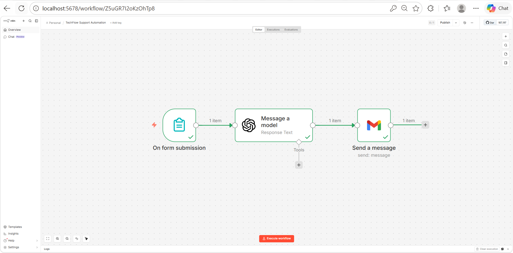
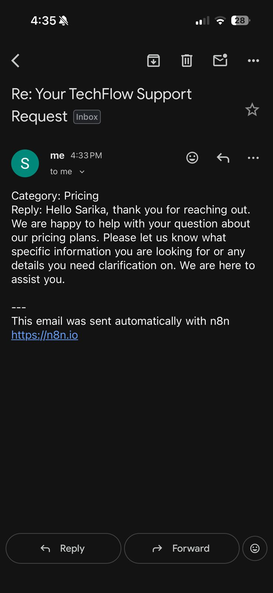

# AI Business Automation Workflow (n8n)

An AI-powered business automation workflow built using n8n, OpenAI API, Gmail integration, and automated email generation.

## Features

- Automated form/request processing
- AI-generated email responses
- Gmail automation
- n8n workflow orchestration
- Dynamic field mapping
- Zero manual response handling after setup

## Tech Stack

- n8n
- OpenAI API
- Gmail API
- Webhooks
- AI Automation

## How It Works

A customer request enters the workflow, OpenAI generates a contextual response, and Gmail automatically sends the personalised reply.

## Project Screenshots

### AI Business Automation Workflow

### Automated AI Email Response

## Example Use Cases

- Customer support automation
- Lead response automation
- AI-powered email replies
- Business workflow automation

## Portfolio

https://saarika-ai.github.io
